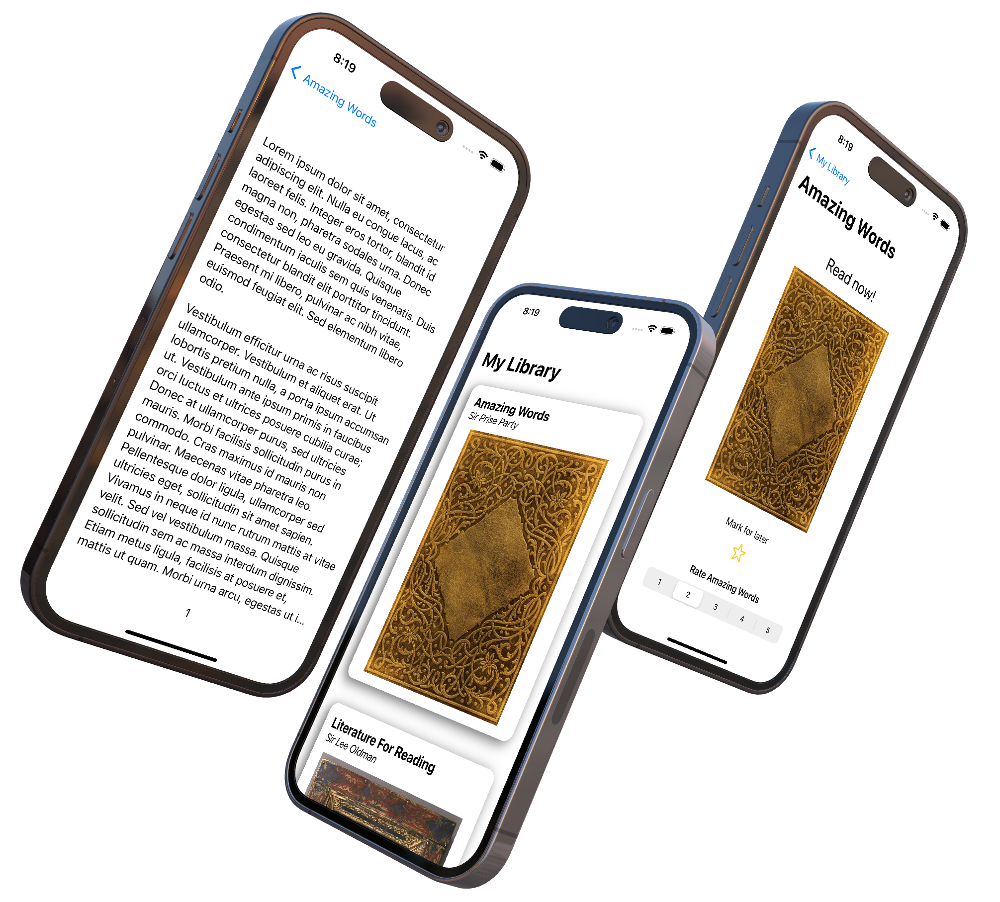

# Simple Book app Tutorial
### (Design was given, not code)

 

## Description
This is a book app for selecting, rating, and marking books. The app idé came from a iOS course where students were given a design on the final product. 
And the students had to make their own implementation. The start screen is a list of cards about each book. upon clicking on one, you will be taken to a more
detailed view. Here, you can add it to your favorites, rate the book, or read it by clicking on the book cover. Data like your favorites and rating will be
saved within a session. 

The most challening part was figuring out data binding. How to update a view when a value is updated. After some googling and testing, I finally solved it. 
Now when you click the start on a back and go back to the main screen, a star will be added next to it's title. 
A bug that I couldn't solve, is the inconsistent back button of different books. 

## What I learened:
* MVVM structure
* Json parsing
* Data flow with enviromental objects
* Navigation view and links
* Variable two way binding.
* Multiple views
* Code within views
